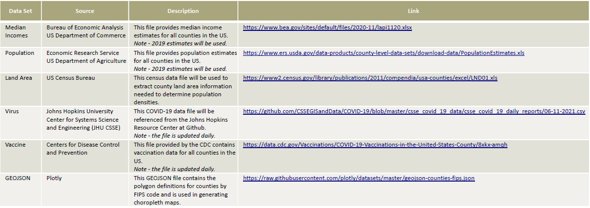

# Wealth and Population Density Influences on COVID-19 Cases, Deaths, and Vaccinations Using Machine Learning
by Ken Noppinger

## Introduction
This research investigates the influence that wealth and population density have had on the COVID-19 pandemic in the United States. 

Since March 2020, the COVID-19 virus has raged through the US and around the world. To date, there are over 175 million cases worldwide and approaching 35 million cases within the US alone. The US death toll is over 600 thousand.  Health organizations have placed a significant emphasis on social distancing and wearing masks to prevent virus spread through airborn droplets.  Federal and state governments put lockdowns in place and after a year have only recently lifted lockdowns as vaccines have become available and the population is approaching herd immunity.  

The goal of this study is to use machine learning on US county data with a focus on uncovering possible correlations of wealth and population density relative to the virus cases, deaths, and vaccinations.

## Unit of Analysis
US County is the unit of analysis for this research.  

This unit is represented in the data by the FIPS code

* 5-digit Federal Information Processing Standards (FIPS) code uniquely identifying counties and county equivalents in the United States.  
* Data sets are joined using the FIPS code (with corresponding county names)
* Used to group data features such as population density, income, COVID cases, deaths, and vaccinations during analysis and machine learning.

## Data Sets

- Median Incomes Data 

  https://www.bea.gov/sites/default/files/2020-11/lapi1120.xlsx 

  This file provides median income estimates for all counties in the US (note - 2019 estimates will be used).

- Population Data 

  https://www.ers.usda.gov/data-products/county-level-data-sets/download-data/PopulationEstimates.xls

  This file provides population estimates for all counties in the US (note - 2019 estimates will be used).

- Land Area Data 

  https://www2.census.gov/library/publications/2011/compendia/usa-counties/excel/LND01.xls

  This census data file will be used to extract county land area information needed to determine population densities.

- Virus Data 

  https://github.com/CSSEGISandData/COVID-19/blob/master/csse_covid_19_data/csse_covid_19_daily_reports/06-11-2021.csv 

  This COVID-19 data file will be referenced from the Johns Hopkins Resource Center at Github (note - the file is updated daily).

- Vaccine Data 

  https://data.cdc.gov/Vaccinations/COVID-19-Vaccinations-in-the-United-States-County/8xkx-amqh 

  This file provided by the CDC contains vaccination data for all counties in the US (note - the file is updated daily).

- GEOJSON Data 

  https://raw.githubusercontent.com/plotly/datasets/master/geojson-counties-fips.json

  This GEOJSON file contains the polygon definitions for counties by FIPS code and is used in generating choropleth maps.
  
## Hypothesis / Research Question(s)
The study will serve to answer the following questions:

  1.  Have wealthy counties been impacted differently by COVID-19?
  2.  Has county population density played a role in COVID-19? 
  3.  Have county wealth and population density together influenced COVID-19 infections, deaths, and vaccinations?

## Implementation (Model)
Of the variety of machine learning techniques, clustering is widely used for revealing structures in data as it works for both labelled and unlabeled data. The special feature of clustering is that it works very well on datasets where simple relationships among data items is unknown.  This aspect makes clustering an ideal choice for modeling the data for this study. 

There are various clustering algorithms available but simple k-Means Centroid-based clustering will be used for this study.  Centroid-based clustering organizes the data into non-hierarchical clusters and it uses a Euclidian distance based clustering mechanism.  This method is typically faster than other clustering techniques.  

Basic k-Means Machine Learning Implementation[1]:
1.  Select k points at random as centroids.
2.  Assign data points to the closest cluster based on Euclidean distance
3.  Calculate centroid of all points within the cluster
4.  Repeat these steps iteratively until convergence.

The elbow method will be used to determine the optimal number of clusters.  To do this, the k means implementation will be executed for multiple k values and plotted against the sum of squared distances from the centroid (loss function)[1].  The elbow of the curve is where the curve visibly bends and this will be selected as the optimum k.

The process above will be applied first to income data, then population data, and the various COVID data.  Combinations of the data will then be attempted to glean knowledge from consolidated data clusterings.

## References
1. alifia2. “Centroid Based Clustering : A Simple Guide with Python Code.” Analytics Vidhya, 27 Jan. 2021, www.analyticsvidhya.com/blog/2021/01/a-simple-guide-to-centroid-based-clustering-with-python-code/. 
